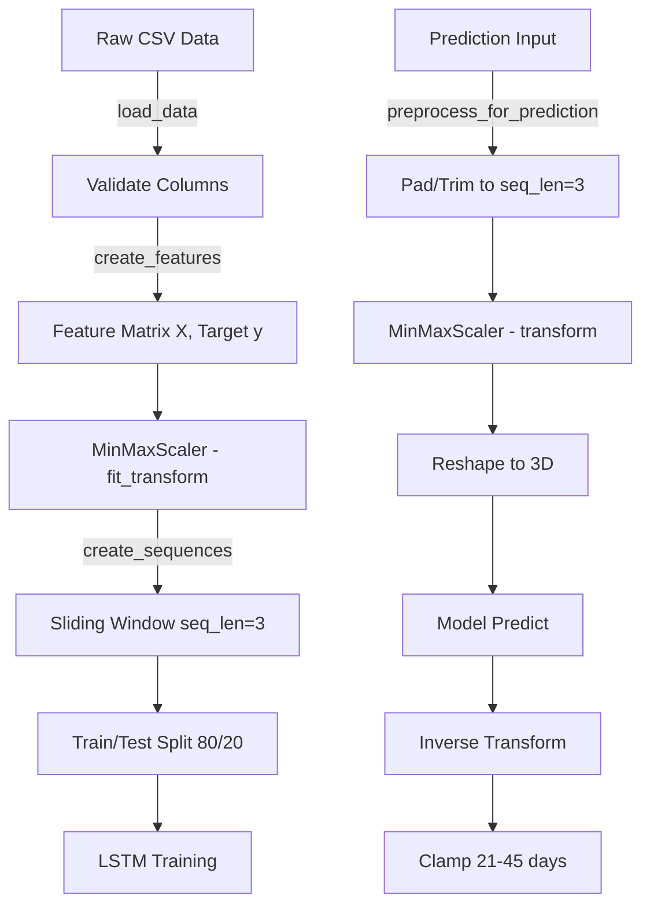

# 🧠 ML Service — Menstrual Health Companion

Microservice prediksi siklus menstruasi menggunakan **LSTM (Long Short-Term Memory)** deep learning model, dibangun dengan **Flask** dan **TensorFlow**.

---

## 🛠️ Tech Stack

| Technology       | Version | Purpose                           |
| ---------------- | ------- | --------------------------------- |
| **Python**       | 3.10+   | Runtime                           |
| **Flask**        | 3.1.0   | REST API framework                |
| **Flask-CORS**   | 5.0.0   | Cross-origin support              |
| **TensorFlow**   | 2.16.1  | Deep learning framework           |
| **scikit-learn** | 1.4.0   | Data preprocessing (MinMaxScaler) |
| **Pandas**       | 2.2.0   | Data manipulation                 |
| **NumPy**        | 1.26.4  | Numerical computing               |
| **joblib**       | 1.3.2   | Serialization (scalers)           |

---

## 🚀 Quick Start

```bash
# 1. Install dependencies
pip install -r requirements.txt

# 2. Train the model (first time only)
python train.py

# 3. Start prediction API
python app.py
# → http://localhost:5001
```

---

## 📁 Project Structure

```
ml-service/
├── requirements.txt     # 📦 Python dependencies
├── app.py               # 🚀 Flask API server
├── train.py             # 🏋️ Model training script
├── preprocess.py        # 🔄 Data preprocessing pipeline
├── data/
│   └── sample_data.csv  # 📊 Training dataset
└── model/
    ├── lstm_model.h5    # 🧠 Trained Keras model
    ├── scaler_X.pkl     # 📐 Feature scaler (MinMaxScaler)
    └── scaler_y.pkl     # 📐 Target scaler (MinMaxScaler)
```

---

## 🧠 LSTM Model Architecture

### Network Topology

```
┌─────────────────────────────────────────┐
│           Input Layer                    │
│   Shape: (3, 5) = 3 timesteps × 5 feat │
├─────────────────────────────────────────┤
│         LSTM Layer 1                     │
│   64 units, return_sequences=True       │
├─────────────────────────────────────────┤
│         Dropout (0.2)                    │
├─────────────────────────────────────────┤
│         LSTM Layer 2                     │
│   32 units                              │
├─────────────────────────────────────────┤
│         Dropout (0.2)                    │
├─────────────────────────────────────────┤
│         Dense Layer                      │
│   16 units, activation=ReLU             │
├─────────────────────────────────────────┤
│         Output Layer                     │
│   1 unit (predicted cycle length)       │
└─────────────────────────────────────────┘
```

### Input Features (5 features per timestep)

| #   | Feature         | Range      | Description                    |
| --- | --------------- | ---------- | ------------------------------ |
| 1   | `cycle_length`  | 21–45 hari | Panjang siklus menstruasi      |
| 2   | `period_length` | 3–7 hari   | Durasi menstruasi              |
| 3   | `avg_sleep`     | 1–5        | Rata-rata kualitas tidur       |
| 4   | `avg_stress`    | 1–5        | Rata-rata tingkat stres        |
| 5   | `fasting_days`  | 0+         | Jumlah hari puasa dalam siklus |

### Sequence Configuration

- **Sequence Length**: 3 (menggunakan 3 siklus terakhir untuk prediksi)
- **Target**: Panjang siklus berikutnya (next_cycle_length)

---

## 🔄 Data Preprocessing Pipeline



### Training Preprocessing (`preprocess_for_training`)

1. Load CSV → validate required columns
2. Extract features (`cycle_length`, `period_length`, `avg_sleep`, `avg_stress`, `fasting_days`)
3. Scale features & target with `MinMaxScaler`
4. Create sliding window sequences (length=3)
5. Save scalers to `model/scaler_X.pkl` dan `model/scaler_y.pkl`

### Prediction Preprocessing (`preprocess_for_prediction`)

1. Pad data jika kurang dari 3 siklus (pad with averages)
2. Estimate `period_length` jika tidak tersedia
3. Load saved scalers → transform features
4. Reshape to 3D: `(1, seq_length, n_features)`

---

## 🏋️ Training

### Training Script (`train.py`)

```bash
python train.py
```

**Output:**

- Model: `model/lstm_model.h5` dan `model/lstm_model.keras`
- Scalers: `model/scaler_X.pkl`, `model/scaler_y.pkl`
- Metrics: MSE, MAE (scaled & actual days)

### Training Configuration

| Parameter         | Value                                |
| ----------------- | ------------------------------------ |
| Epochs            | 200 (max)                            |
| Batch Size        | 8                                    |
| Optimizer         | Adam (lr=0.001)                      |
| Loss              | MSE (Mean Squared Error)             |
| EarlyStopping     | patience=20, restore_best_weights    |
| ReduceLROnPlateau | factor=0.5, patience=10, min_lr=1e-6 |

### Dataset (`data/sample_data.csv`)

| Column            | Description                            |
| ----------------- | -------------------------------------- |
| cycle_length      | Panjang siklus saat ini                |
| period_length     | Durasi menstruasi                      |
| avg_sleep         | Rata-rata tidur (1-5)                  |
| avg_stress        | Rata-rata stres (1-5)                  |
| fasting_days      | Hari puasa dalam siklus                |
| next_cycle_length | **Target** — panjang siklus berikutnya |

---

## 🔌 API Reference

### Health Check

```http
GET /health
```

**Response:**

```json
{
  "status": "ok",
  "model_loaded": true
}
```

### Prediction

```http
POST /predict
Content-Type: application/json

{
  "cycles": [28, 30, 27],
  "sleep": [4, 3, 4],
  "stress": [2, 3, 2],
  "fasting": [0, 5, 0]
}
```

**Response (Model Loaded):**

```json
{
  "predicted_cycle_length": 28,
  "confidence": 0.85,
  "model_version": "1.0"
}
```

**Response (Model Not Loaded — Fallback):**

```json
{
  "predicted_cycle_length": 28,
  "confidence": 0.5,
  "model_version": "fallback_average",
  "message": "Model not loaded. Using simple average."
}
```

### Input Validation

- `cycles`: **Required**, minimal 1 entry
- `sleep`, `stress`, `fasting`: Optional (default values digunakan jika kosong)

### Confidence Calculation

```
base_confidence = 1.0 - (std_deviation(cycles) / 10.0)
data_factor = min(1.0, num_cycles / 6.0)
final_confidence = clamp(base_confidence × data_factor, 0.3, 0.95)
```

### Output Clamping

Hasil prediksi di-clamp ke range **21–45 hari** untuk menghindari prediksi yang tidak realistis.

---

## 🔄 Fallback Mechanism

Jika model gagal dimuat atau error saat prediksi:

```
1. Model not found → Simple average of cycle lengths (confidence: 0.5)
2. Prediction error → Return 28 days default (confidence: 0.3)
3. ML service unreachable → Backend uses own average calculation
```

Ini memastikan aplikasi tetap berfungsi meskipun ML service bermasalah.

---

## 📊 Model Files

| File            | Size    | Description                            |
| --------------- | ------- | -------------------------------------- |
| `lstm_model.h5` | ~414 KB | Trained Keras LSTM model (HDF5 format) |
| `scaler_X.pkl`  | ~1 KB   | Feature scaler (MinMaxScaler)          |
| `scaler_y.pkl`  | ~1 KB   | Target scaler (MinMaxScaler)           |

> **Note**: File model sudah included di repository. Untuk re-train, jalankan `python train.py`.
